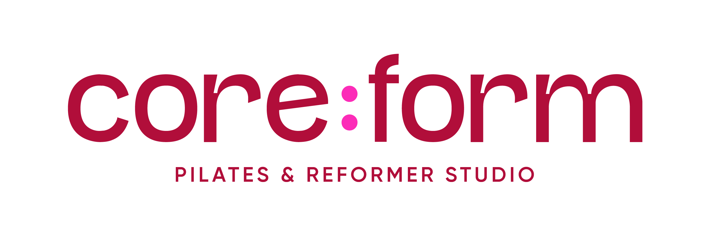
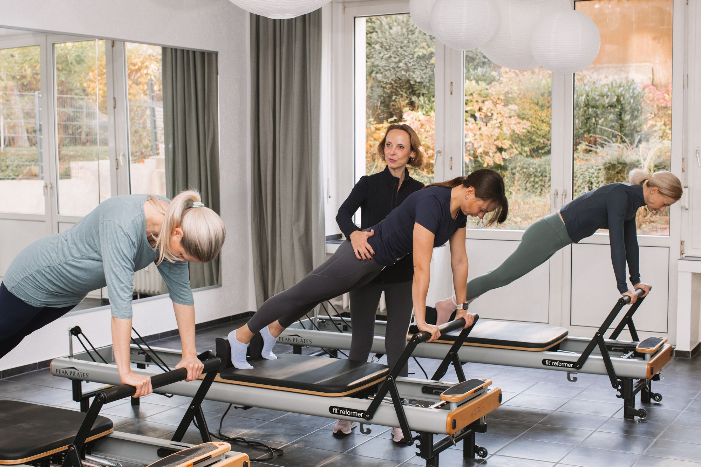

# core:form — Projektdokumentation

Pilates & Reformer Studio Essen. Zwei Standorte:
- **Studio Rüttenscheid** — Gudulastraße 5 (Innenhof), 45131 Essen — Pilates Matte & Barre Workout
- **Studio Südviertel** — Moltkestraße 16, 45128 Essen — Reformer Pilates & Raumvermietung (eröffnet 01.11.2025)

> **Hinweis:** Die Design-Vorlage in `claude design/README.md` führt ältere Adressen (Gudulastr. 3e / Moltkestr. 31). Maßgeblich sind die Adressen oben — sie spiegeln den tatsächlichen Stand wider (siehe `index.html` Kontaktsektion, `impressum.html`, `faq.html`).

---

## Architektur

Statisches Multi-Page-Setup. Kein Build-Step, kein npm.

| Datei | Stack | Zweck |
|---|---|---|
| `index.html` | React 18 + Babel Standalone via CDN, JSX inline | Startseite (Single-Page-Scroll) |
| `buchung.html`, `buchung-ruettenscheid.html`, `buchung-suedviertel.html` | Vanilla HTML | Buchungsseiten mit Eversports-Widget |
| `ausbildung.html` | Vanilla HTML | Reformer-Lehrerausbildung (Landingpage mit Testimonial-Karussell) |
| `galerie.html` | Vanilla HTML | Galerie mit Lightbox (Inline-Script, Tasten- & Swipe-Navigation) |
| `videos.html` | Vanilla HTML | Trainings-Videos im Grid (autoplay, muted, loop) + Klick-Overlay mit scrollbarer Beschreibung direkt auf der Kachel |
| `faq.html`, `impressum.html`, `datenschutz.html`, `agb.html` | Vanilla HTML | Inhalts- und Rechtsseiten |
| `css/site.css` | gemeinsames CSS für alle Seiten (inkl. `index.html`) | Design-System, Layout, Subpage-Styles |
| `js/chrome.js` | gemeinsames JS für alle **statischen** Subpages | Nav, Mobile-Menu, Newsletter-Popup, Eversports-Widget (consent-gated) |
| `js/consent.js` | gemeinsames JS, **auf jeder Seite vor `chrome.js`** | DSGVO-Cookie-Banner, lädt reCAPTCHA dynamisch, gibt `cf:consent` Event frei |
| `data/newsletter.html` | per `fetch` geladenes Popup-Markup | wird auf allen Seiten dynamisch eingebunden |
| `mail.php` | PHP 8.x | Kontaktformular-Endpoint mit reCAPTCHA-v3-Verify, Honeypot, JSON-Response |
| `config.php` | PHP, **nicht** im Repo (`.gitignore`) | Secrets: `RECAPTCHA_SECRET`, `MAIL_TO`. Liegt nur auf dem Server, via `.htaccess` vor HTTP-Zugriff geschützt |
| `config.sample.php` | PHP-Template | Vorlage ohne echte Werte — als Basis für die echte `config.php` auf dem Server |
| `.htaccess` | Apache | HTTPS-Redirect, Security-Headers (HSTS, X-Frame-Options, etc.), Blockt `config.php` und sensible Endungen |
| `robots.txt` | Plain Text | Allow/Disallow-Regeln für Crawler · Sitemap-Verweis |
| `sitemap.xml` | XML | Sitemap mit den **drei indexierten** Seiten (Startseite, Buchung, Ausbildung) inkl. Image-Sitemap |

```
index.html             ← React-App
buchung*.html          ← statisch, nutzen chrome.js + consent.js
ausbildung.html        ← statisch, nutzen chrome.js + consent.js (Landingpage)
galerie.html           ← statisch, nutzen chrome.js + consent.js + eigene Lightbox
videos.html            ← statisch, nutzen chrome.js + consent.js + Inline-Toggle für Bio (KEIN TON)
faq.html               ← statisch, nutzen chrome.js + consent.js
impressum.html         ← statisch, nutzen chrome.js + consent.js
datenschutz.html       ← statisch, nutzen chrome.js + consent.js
agb.html               ← statisch, nutzen chrome.js + consent.js
css/site.css           ← gemeinsames Stylesheet (Pflicht für alle Seiten)
js/chrome.js           ← Nav, Mobile-Menu, Newsletter-Popup, Eversports-Widget
js/consent.js          ← Cookie-Banner, reCAPTCHA-Loader, Privacy-Trigger
data/newsletter.html   ← Newsletter-Popup-Inhalt (per fetch)
mail.php               ← Kontaktformular-Endpoint (reCAPTCHA + Honeypot)
config.php             ← Secrets (NUR auf dem Server!)
config.sample.php      ← Template ohne echte Werte
.htaccess              ← HTTPS, Security-Headers, Datei-Blocker
robots.txt             ← Crawler-Regeln
sitemap.xml            ← Sitemap der 3 SEO-Seiten
font/                  ← Stacion OTF + DM Sans WOFF2 (lokal, kein Google-Fonts-CDN mehr)
media/                 ← Bilder & Logos
claude design/         ← kanonische Design-System-Quelle (README.md, colors_and_type.css)
```

`css/styles.css`, `js/main.js`, `index_old.html`, `index_v1.html`, `index_v2.html`, `index_v3.html` sind **alte Stände** — nicht aktiv, nicht editieren.

### Hosting

- **Provider:** udmedia.de (Shared Hosting, PHP 8.x)
- **Webroot Produktion:** `/html/staging/` (nach Go-Live)
- **WordPress-Altbestand:** `/html/wordpress/` (wird nach Go-Live archiviert)
- **Go-Live-Schalter:** `startverzeichnis` der Domain im udmedia-Panel von `/wordpress` auf `/staging` ändern — 1 Klick, sofort wirksam, jederzeit rückgängig.
- **FTP:** SFTP auf Port 33, Zugangsdaten im udmedia-Panel.
- **E-Mail-Konto:** `info@core-form.de` existiert auf demselben Server (von Eva genutzt); `noreply@core-form.de` wird als technische Absenderadresse verwendet — muss kein echtes Postfach sein, aber **muss zur Domain core-form.de gehören** (sonst SPF-Fehler und `mail()` schlägt fehl).

---

## Design-System (Quelle der Wahrheit: `claude design/`)

Vollständige Spezifikation: `claude design/README.md` und `claude design/colors_and_type.css`. Die Werte hier dürfen **nicht** verändert werden — sie sind die Leitplanken für jede neue Seite.

### Farbpalette

| Token | Hex | Verwendung |
|---|---|---|
| Himbeere | `#b20e3b` | CTAs, Links, Akzente, Labels, Hamburger-Icon, Hover-Underline in Nav |
| Brombeere | `#59071d` | Hover auf Primary, Featured-Card-BG, Text auf Creme (semantic `--fg-on-creme`) |
| Creme | `#f2dac2` | Warme Sektionshintergründe, Subpage-Hero |
| Pistazie | `#aed9b3` | Logo-Akzent (Moltke), dezente Akzente |
| Blau | `#095873` | Education-/Highlight-Sektionen (in Subpages bislang nicht verwendet) |
| Pink | `#fc2cb8` | **Nur** der Doppelpunkt im Logo |
| Schwarz | `#0d0d0d` | Body-Text, Hero-BG, Footer |
| Grau-dunkel | `#2a2a2a` | sekundärer Body-Text (Prosa, Karten-Beschreibungen) |
| Grau-mittel | `#8c8c8c` | gedämpfte Captions / Labels |
| Off-White | `#f6f9f7` | dezente Sektions-Alternative · **Studio-Süd-Tint** (Booking-Widget-BG Süd, Format-Cards) |
| Rosa-Tint | `#fdf6fa` | **Studio-Rü-Tint** (Booking-Widget-BG Rü) — leicht himbeerig getönt |
| Weiß | `#ffffff` | Default-BG |

**Sektions-Rhythmus:** weiß → creme → dunkel/teal → weiß → creme. Hero-Bild ankert die Seite oben.

### Typografie

- **Stacion** (lokal, OTF) — Headlines (H1, H2, H3, Preiszahlen). Light-Italic (300 italic) für Emphase-Wörter in Headlines.
- **DM Sans** (**lokal**, WOFF2 in `font/dm-sans-v17-latin_latin-ext-*.woff2`) — Body, Nav, Labels, Buttons. **Kein** Google-Fonts-CDN mehr (DSGVO + Performance). `@font-face`-Deklarationen für die Schnitte 300, 300i, 400, 400i, 500, 600, 700 stehen am Anfang von `css/site.css`.
- Nav-Links: 12 px, `font-weight:500`, `letter-spacing:.08em`, uppercase.
- Eyebrows/Labels: 11 px, `font-weight:600`, `letter-spacing:.15em`, uppercase, Himbeere.
- H1 Subpage-Hero: `clamp(40px, 6vw, 72px)`, Stacion light, `letter-spacing:-.02em`.
- Body 16 px, Line-Height 1.7. Prosa 15 px, Line-Height 1.75.

### Buttons

- `border-radius:0` — keine abgerundeten Ecken.
- `font-weight:700`, uppercase, `letter-spacing:.15em`, 11 px.
- Klassen: `.btn .btn--accent` (primär, Himbeere → Brombeere), `.btn--outline` (schwarz), `.btn--ghost` (über Bild, weiß), `.btn--full` (100 % Breite).

### Spacing

- Sektions-Padding: **96 px** desktop / **48 px** mobile (Top + Bottom).
- Container: `max-width:1160px`, Padding `0 40px` desktop / `0 18-24px` mobile.
- Großzügiger Whitespace; Sektionsteilung über Hintergrundfarbe, **nicht** über `<hr>`.

### Animation

- Ease-out (`cubic-bezier(.22,1,.36,1)`), Dauer 250–450 ms.
- Hover: Farbübergang, **kein** Scale, **kein** neuer Box-Shadow.

### Sprachkonventionen

- **Nur Deutsch**, informelles „du".
- Genderform per Doppelpunkt: `Trainer:innen`, `Teilnehmer:innen`, `Ausbilder:innen`.
- **Keine Ausrufezeichen** in Fließtext (Brand spricht ruhig, nicht laut).
- **Keine Emojis**.
- Headlines stacken kurz und enden auf Punkt: „Kraft. Kontrolle. Bewegung." Subpage-H1 trägt **immer** den Schlusspunkt — auch einzelne Wörter („Impressum.", „FAQ.").
- Italic in Headlines (`<em>`) für Wärme: „Bewegung mit *Haltung.*", „*Geschäftsbedingungen.*".
- Eyebrows in Caps: „RECHTLICHES", „STUDIO 01 · RÜTTENSCHEID", „ONLINE BUCHEN".
- Zahlen sind Held:innen: „2 Studios in Essen", „max. 9 Teilnehmer:innen".

### Verbots-Wording (faktisch falsch)

- **Niemals „zertifiziert" über die Reformer-Ausbildung oder die Trainer:innen** schreiben. Die Ausbildung ist ein **studiointernes Qualifizierungsformat**, keine verbandlich zertifizierte Ausbildung. Eva ist **Mitglied** im Deutschen Pilates Verband (DPV) — das ist eine Mitgliedschaft, keine Verbandszertifizierung der Lehrtätigkeit.
- Statt „zertifizierte Programme" → **„durchdachte Programme"**, „strukturierte Programme", „fundierte Programme".
- Statt „zertifizierte Trainer:innen" / „zertifizierte Ausbilder:innen" → **„erfahrene Trainer:innen"**, „gut ausgebildete Trainer:innen", „aktive Mitgliedschaft" (für DPV-Bezug).
- Bei DPV-Badges (`DPV_PremiumSiegel2026.png`, `Zertifikat2026.png`): Beschriftung **„Premium-Mitglied"** oder **„Aktive Mitgliedschaft"** in Kombination mit „Deutscher Pilates Verband". Niemals als Lehr-Zertifikat ausgeben.
- Korrekt formulierter Hinweis (in `ausbildung.html` bereits enthalten): „Die Ausbildung ist ein studiointernes Qualifizierungsformat und keine verbandlich zertifizierte Ausbildung."

---

## Asset-Mapping

Die Vorlage in `claude design/` nutzt Pfade wie `../../assets/` und `../../fonts/`. Im Projekt sind diese auf:

| Design-Pfad | Echter Pfad |
|---|---|
| `../../fonts/stacion-*.otf` | `font/stacion-*.otf` |
| `../../assets/logo-gudula.png` | `media/RZ_Logo_CoreForm_Gudula.png` |
| `../../assets/logo-gudula-white.png` | `media/RZ_Logo_CoreForm_Gudula_weiss.png` |
| `../../assets/logo-gudula-white-pink.png` | `media/RZ_Logo_CoreForm_Gudula_weiss_pink.png` |
| `../../assets/logo-moltke.png` | `media/RZ_Logo_CoreForm_Moltke.png` |
| `../../assets/logo-moltke-white-pink.png` | `media/RZ_Logo_CoreForm_Moltke_weiss_pink.png` |
| `../../assets/web-0XX.jpg` | `media/COREFORM_web_0XX.jpg` |
| `../../assets/eva-01.jpg` | `media/Eva-Pilates 01.jpg` |
| `../../assets/eva-jelena.jpg` | `media/Eva & Jelena.jpg` |

### Logo-Verwendung (zwingend)

| Kontext | Logo |
|---|---|
| Nav (transparent / Hero) | `RZ_Logo_CoreForm_Gudula_weiss_pink.png` (weiß-pink) |
| Nav (scrolled / `.nav.solid`) | `RZ_Logo_CoreForm_Gudula.png` (Farbe) |
| Nav bei offenem Mobile-Menü | `RZ_Logo_CoreForm_Gudula_weiss_pink.png` |
| **Footer (alle Seiten)** | `RZ_Logo_CoreForm_Gudula_weiss.png` |
| Studio-Panel Rüttenscheid | `RZ_Logo_CoreForm_Gudula.png` |
| Studio-Panel Südviertel | `RZ_Logo_CoreForm_Moltke.png` |

> **Regel aus `claude design/README.md`:** Gudula ist die primäre Nav-/Footer-Identität. Standortspezifische Logos nur in Studio-Panels/-Cards.

### Studio-Farb-Konvention (Logo + Studio-Hintergrund hängen zusammen)

Jedes Studio hat eine eigene Sub-Farbpalette, die sowohl im Logo wie auch im Hintergrund von studio-spezifischen Sektionen (z. B. Eversports-Widget) durchscheint. Diese Zuordnung ist verbindlich — wenn jemand eine neue studio-spezifische UI-Fläche baut, muss die richtige Variante gewählt werden:

| Studio | Kürzel | Adresse | Logo (Akzentfarbe) | Hintergrund-Tint | CSS-Klasse |
|---|---|---|---|---|---|
| **Rüttenscheid** | Rü / rue | Gudulastraße 5 | `RZ_Logo_CoreForm_Gudula.png` (himbeere) | `#fdf6fa` (rosa) | `.booking-widget-rue` |
| **Südviertel** | Süd / sued | Moltkestraße 16 | `RZ_Logo_CoreForm_Moltke.png` (salbeigrün) | `#f6f9f7` (off-white) | `.booking-widget-sued` |

**Hintergrund:** Die Eversports-Widgets der jeweiligen Studios haben selbst diese Hintergrundtöne — die Sektion drumherum nimmt sie auf, damit das Widget nahtlos sitzt.

**Folgeregel:** Wenn neue Studio-spezifische Elemente entstehen (Karten, Banner, Buchungs-Sektionen, Workshop-Promos), die Farbe entsprechend zum Studio wählen — nicht zufällig.

Die generische `.booking-widget`-Klasse bleibt für die übergeordnete `buchung.html` reserviert (zeigt beide Studios + Workshops/Ausbildung).

**Ausnahme — Kontaktblock (Startseite):** Im `.kontakt__studios`-Block stehen die Studio-Logos **über** dem Adresstext (linksbündig, Logo `height:34px`, `margin-left:-9px` zum Ausgleich der transparenten PNG-Fläche), und der Studio-Name (`STUDIO RÜTTENSCHEID` / `STUDIO SÜDVIERTEL`) ist **plain `#0d0d0d`** — keine himbeere/salbei-Hervorhebung. Das Logo trägt die Studio-Identität, der Text muss das nicht doppeln.

### Favicon

Auf jeder Seite im `<head>` direkt nach `<title>` einbinden:

```html
<link rel="icon" type="image/jpeg" href="media/IMG-20251021-WA0011.jpg">
<link rel="apple-touch-icon" href="media/IMG-20251021-WA0011.jpg">
```

Die Datei `media/IMG-20251021-WA0011.jpg` ist die kanonische Favicon-Quelle — bei Logo-Wechsel an dieser Stelle ersetzen, dann zieht es automatisch auf alle Seiten durch.

### Bilder pro Sektion (Startseite, aktueller Stand)

| Sektion | Bild |
|---|---|
| Hero | `COREFORM_web_015.jpg` |
| Reformer Pilates | `COREFORM_web_005.jpg` |
| Pilates Matte | `Eva-Pilates 01.jpg` |
| Barre Workout | `Eva-Pilates 06.jpg` |
| Personal Training | `COREFORM_web_009.jpg` |
| Raumvermietung | `Eva-Pilates 07.jpg` |
| Feature Banner | `COREFORM_web_010.jpg` |
| Studio Rüttenscheid | `Eva-Pilates 02.jpg` |
| Studio Südviertel | `COREFORM_web_002.jpg` |
| Über uns | `Eva & Jelena.jpg` |

---

## Navigation & Mobile (Startseite & Subpages)

### Desktop-Nav

- Auf `index.html`: transparent über dem Hero, wechselt bei `scrollY > 40px` auf `rgba(255,255,255,.97)` + Blur (Klasse `.nav.scrolled`).
- Auf **allen Subpages**: bekommt von Anfang an Klasse `.nav.solid` (immer hell, kein Scroll-Wechsel).
- Logo-Image-Tausch wird auf der Startseite via React-State gesteuert, auf Subpages via `chrome.js` (anhand `data-logo-dark` / `data-logo-light` Attributen).
- Aktive Sektion auf der Startseite per `IntersectionObserver` → Himbeere-Unterstrich (`::after`).

### Mobile-Nav (≤ 1023 px — Tablet & Phone)

- **Breakpoint:** Hamburger-Modus greift ab `max-width:1023px` (nicht 768!). Grund: Auf Tablets wirkten die sieben Desktop-Nav-Links zu gedrungen, und das Logo verhielt sich relativ zur Container-Breite zu groß. Tablets bekommen daher dieselbe Mobile-Nav wie Phones.
- Nav-Links werden ausgeblendet, Hamburger-Icon erscheint, CTA-Group (buchen + News) bleibt sichtbar.
- Hamburger: 3 Balken, Himbeere `#b20e3b` auf hellem Hintergrund, Weiß auf dunklem Hintergrund.
- **Wichtig:** Das Mobile-Menü-`<nav id="mobile-menu">` ist ein **Geschwister außerhalb des `<header>`** — nicht darin verschachtelt. Grund: `backdrop-filter` auf `.nav.scrolled`/`.nav.solid` erzeugt einen Stacking-Context, der `position:fixed` von Kindelementen bricht.
- Menü-Overlay: `rgba(13,13,13,.67)` + `blur(20px)` (Frosted Glass).
- Bei offenem Menü: Nav bekommt `.menu-open` Klasse + Logo wechselt auf weiß-pink + CTA-Group wird visuell verborgen.

### Phone-spezifische Verfeinerungen (≤ 768 px)

- Logo schrumpft auf `30px × 90px` (statt Desktop/Tablet `36px × 108px`).
- Container-Padding reduziert auf `0 18px` (statt `0 40px`).
- CTA-Buttons enger (`padding:8px 10px`, kleinere Letter-Spacing) — beide passen so neben das Hamburger-Icon.

---

## React-State (nur `index.html`)

```js
scrolled       // boolean — Nav-Hintergrund-Wechsel
activeId       // string  — aktive Sektion für Nav-Unterstrich
mobileOpen     // boolean — mobiles Menü auf/zu
popupOpen      // boolean — Newsletter-Popup auf/zu
newsletterHtml // string  — per fetch geladener Popup-Inhalt
submitted      // boolean — Kontaktformular abgesendet
teamIndex      // number  — aktive Person im Team-Karussell
teamStage      // 0|1|2   — Overlay-Stufe (0 = nur Bild, 1 = Name+Rolle, 2 = Name+Rolle+Bio)
priceModalKey  // string|null — geöffnetes Preis-Modal ('matte'|'reformer'|'personal')
```

`scroll(id)` schließt das mobile Menü automatisch.

### Team-Karussell — Bedienung & Stage-Verhalten

Die `teamStage`-Stufe zykelt **per Klick auf die aktive Karte** durch `0 → 1 → 2 → 0`. **Navigation (links/rechts-Pfeile, Pfeiltasten ←/→, Swipe, Dot-Pagination) ändert nur `teamIndex` und behält die aktuelle Stufe** — d. h. wenn man bei Stufe 1 (Name) ist und nach rechts navigiert, sieht man die nächste Person ebenfalls in Stufe 1. Geschlossen wird das Overlay nur durch Outside-Click oder Escape (→ Stufe 0). Auto-Rotate pausiert, sobald `teamStage > 0`.

### Performance — Pre-Render-Skelett & Preloads

Im `<head>` von `index.html` stehen `preconnect`-Hints auf `fonts.googleapis.com`, `fonts.gstatic.com` und `unpkg.com`, sowie `preload`-Tags für das Hero-Bild und das Nav-Logo (weiß-pink-Variante). Das `<div id="root">` enthält ein **statisches Hero-Skelett** mit einem minimalen Nav-Header (nur Logo) und dem Hero-Bild — dieses Skelett wird sichtbar, bevor React + Babel-Standalone das JSX transpiliert haben, und nahtlos durch die React-App ersetzt. **Beim Anpassen des Hero-Bildes oder Logos diese Stellen im Skelett mitziehen**, sonst zeigt der erste Frame veralteten Content. Mittelfristig wäre ein Build-Step oder Migration auf Vanilla-JS (wie Subpages) der nachhaltige Performance-Pfad — Babel-Standalone ist der eigentliche Bremsklotz.

---

## Subpage-Anleitung (Boilerplate für jede neue statische Seite)

> **Anwenden, wenn:** eine neue informative oder rechtliche Seite hinzukommt (z. B. „Über uns", „Workshop XY", „Karriere"), oder eine bestehende erweitert wird. Nicht für `index.html` (React).

### 1. HTML-Grundgerüst (kopieren, nicht neu erfinden)

Jede neue Subpage **muss** dieses Skelett 1:1 enthalten — Reihenfolge, Klassen, IDs, ARIA-Attribute. Inhalt wird nur in `<main id="main-content">` eingesetzt. Nav, Mobile-Menü, Newsletter-Popup und Footer **identisch zu einer existierenden Subpage** (z. B. `faq.html`) übernehmen.

```html
<!DOCTYPE html>
<html lang="de">
<head>
<meta charset="UTF-8">
<meta name="viewport" content="width=device-width, initial-scale=1.0">
<!-- Standard: noindex für alle Subpages. Nur Startseite, ausbildung.html und buchung.html bekommen "index, follow". -->
<meta name="robots" content="noindex, follow">
<title>SEITEN-TITEL — core:form</title>
<link rel="icon" type="image/jpeg" href="media/IMG-20251021-WA0011.jpg">
<link rel="apple-touch-icon" href="media/IMG-20251021-WA0011.jpg">
<link rel="stylesheet" href="css/site.css">
</head>
<body>

<a href="#main-content" class="skip-link">Zum Inhalt springen</a>

<!-- NAV — identisch auf jeder Subpage; Klasse "nav solid" zwingend -->
<header class="nav solid">
  <div class="nav__inner container">
    <a href="index.html" class="nav__logo" aria-label="core:form Startseite">
      
    </a>
    <nav class="nav__links" aria-label="Hauptnavigation">
      <a href="index.html#angebote">Angebote</a>
      <a href="index.html#studios">Studios</a>
      <a href="index.html#ueber-uns">Über uns</a>
      <a href="index.html#ausbildung">Ausbildung</a>
      <a href="index.html#preise">Preise</a>
      <a href="index.html#kontakt">Kontakt</a>
    </nav>
    <div class="nav__cta-group">
      <a href="buchung.html" class="btn btn--accent nav__cta">buchen</a>
      <button type="button" class="btn btn--accent nav__cta nav__cta--news" data-newsletter-trigger>News</button>
    </div>
    <button type="button" class="nav__hamburger" aria-label="Menü öffnen" aria-expanded="false" aria-controls="mobile-menu">
      <span></span><span></span><span></span>
    </button>
  </div>
</header>

<!-- Mobile-Menü — MUSS Geschwister von <header> sein, nicht Kind!
     Volle Inhalte (Links + Actions + Social SVGs) aus z. B. faq.html kopieren. -->
<nav id="mobile-menu" class="nav__mobile" aria-label="Mobile Navigation" aria-hidden="true">
  <!-- … identisch zu anderen Subpages … -->
</nav>

<!-- Newsletter-Popup -->
<div class="newsletter-pop__backdrop" aria-hidden="true"></div>
<aside class="newsletter-pop" role="dialog" aria-modal="true" aria-label="Newsletter" aria-hidden="true">
  <div class="newsletter-pop__head">
    <span class="label">Newsletter</span>
    <button type="button" class="newsletter-pop__close" aria-label="Newsletter schließen">
      <svg width="22" height="22" viewBox="0 0 24 24" fill="none" stroke="currentColor" stroke-width="1.6" stroke-linecap="round" aria-hidden="true" focusable="false">
        <line x1="6" y1="6" x2="18" y2="18" /><line x1="18" y1="6" x2="6" y2="18" />
      </svg>
    </button>
  </div>
  <div class="newsletter-pop__body"><p>Wird geladen …</p></div>
</aside>

<main id="main-content" class="subpage">

  <!-- Pflicht: Hero-Sektion mit Eyebrow, H1 (mit Punkt!), optional Lead-Paragraph -->
  <section class="subpage__hero">
    <div class="container">
      <span class="label">Eyebrow</span>
      <h1>Headline mit <em>Italic-Akzent.</em></h1>
      <p>Optionaler Lead, max. ~3 Zeilen, zur Einordnung.</p>
    </div>
  </section>

  <!-- Inhalt — eine oder mehrere Sektionen mit der passenden Layout-Klasse -->
  <section class="subpage__content">
    <div class="container">
      <div class="prose">
        <h2>…</h2>
        <p>…</p>
      </div>
    </div>
  </section>

</main>

<!-- FOOTER — identisch auf jeder Seite, Logo IMMER Gudula weiß -->
<footer class="footer">
  <div class="container">
    <div class="footer__inner">
      <div class="footer__logo">
        
      </div>
      <span class="footer__copy">© <span data-current-year>2026</span> core:form Pilates Studio GbR, Essen</span>
      <div class="footer__links">
        <a href="impressum.html">Impressum</a>
        <a href="datenschutz.html">Datenschutz</a>
        <a href="agb.html">AGB</a>
        <a href="faq.html">FAQ</a>
        <a href="#" data-privacy-trigger>Privacy</a>
      </div>
    </div>
  </div>
</footer>

<script>
  document.querySelectorAll('[data-current-year]').forEach(function (el) {
    el.textContent = new Date().getFullYear();
  });
</script>
<script src="js/consent.js"></script>
<script src="js/chrome.js"></script>
</body>
</html>
```

### 2. Layout-Klassen je Inhaltstyp

| Inhalt | Wrapper-Klasse(n) | Hintergrund | Beispiel |
|---|---|---|---|
| Rechtliches / Fließtext | `section.subpage__content > .container > .prose` | weiß | impressum, datenschutz, agb |
| FAQ-Akkordeon | `section.subpage__content > .container > ul.faq-list` mit `<details class="faq-item">` | weiß | faq.html |
| Buchungs-Intro / einleitende Absätze | `section.booking-intro > .container > p` | weiß | buchung.html |
| Studio-Wahl-Karten | `section.booking-intro > .container > .studio-cta-grid > article.studio-cta` | weiß (Karten dunkel) | buchung.html |
| Format-Karussell | `section.formate > .container > .format-carousel` | weiß | buchung.html |
| Eversports-Widget | `section.booking-widget > .container > .booking-widget__head` + Widget-Div | off-white `#f6f9f7` | alle buchung*.html |
| Bild-/Text-Hero (mit BG-Image) | nicht in `.subpage`, sondern `.hero` Klasse — siehe `index.html` | dunkel | nur Startseite |
| **Landingpage-Sektionen (Ausbildung & ähnliche Pages)** | siehe Sektionsliste unten | wechselnd weiß / creme / off-white / dunkel | ausbildung.html |
| **Testimonial-Karussell** | `section.ausbildung-testimonials > .testimonial-carousel > article.testimonial-card` | dunkel `#0d0d0d` | ausbildung.html |
| **Galerie-Grid + Lightbox** | `section.galerie > .container > .galerie-grid > button.galerie-tile` + `div#galerie-lightbox` | weiß | galerie.html |
| **Video-Grid mit In-Tile-Bio-Overlay** | `section.videos > .container > .video-grid > div.video-tile` (mit `.video-tile__bio` als Overlay-Layer) | weiß | videos.html |

### 3. Pflichtregeln für jede neue Seite

**Layout & Visuals:**
- `<main>` bekommt **immer** `class="subpage"` (Top-Padding für fixierte Nav).
- Erste Sektion **immer** `.subpage__hero` mit Eyebrow (`<span class="label">`) + H1.
- H1 endet **immer** mit Punkt — auch bei einzelnen Wörtern (z. B. „FAQ.").
- Emphase-Wörter im H1 in `<em>…</em>` (rendert als Stacion-light-italic in Himbeere).
- Sektions-Padding: `96px` desktop / `48px` mobile (bereits in `css/site.css` für `.subpage__*`-Klassen gesetzt — **nicht** überschreiben).
- Hintergrund-Rhythmus alternieren: weiß → creme → off-white. Niemals zwei gleichfarbige Sektionen direkt hintereinander.

**Chrome (Nav, Mobile, Footer):**
- Nav bekommt `class="nav solid"` — niemals nur `nav`.
- Mobile-Menu-`<nav id="mobile-menu">` **außerhalb** des Headers platzieren.
- Newsletter-Popup-Markup (`backdrop` + `aside.newsletter-pop`) auf jeder Seite einfügen — `chrome.js` lädt den Inhalt aus `data/newsletter.html` per `fetch`.
- Footer-Logo **immer** `RZ_Logo_CoreForm_Gudula_weiss.png`.
- Footer-Links genau in der Reihenfolge: Impressum · Datenschutz · AGB · FAQ · **Privacy** (Privacy-Link triggert via `data-privacy-trigger` den Cookie-Banner — siehe Cookie-/Consent-Sektion).
- **Script-Reihenfolge am Ende von `<body>`:** zuerst `<script src="js/consent.js">`, dann `<script src="js/chrome.js">`. consent.js muss zuerst laufen, damit `window.cfConsent` steht, bevor chrome.js die Eversports-Widgets initialisiert.
- **Robots-Meta:** Standardmäßig `noindex, follow` für jede neue Subpage. Nur `index.html`, `ausbildung.html` und `buchung.html` bekommen `index, follow` plus den vollen SEO-Header (siehe SEO-Sektion).

**Sprache & Inhalt:**
- Deutsch, „du", keine Ausrufezeichen, keine Emojis.
- Genderform mit Doppelpunkt.
- CTA-Buttons in `.btn.btn--accent` (CSS macht uppercase + tracking automatisch — Text im Markup in Sentence Case schreiben).
- Eyebrows ebenfalls in Sentence Case (CSS macht uppercase).
- Externe Links: `target="_blank" rel="noopener noreferrer"`.

**Verboten:**
- `border-radius` außer 0 (Ausnahme: Input-Felder 2 px).
- Eigene Farben außerhalb der Palette oben.
- Bouncy/elastische Animationen.
- Icons aus Icon-Fonts (Lucide, FontAwesome). Nur eingebettete SVGs für Social.
- Inline-Styles für Visuals (kleine Layout-Korrekturen wie `display:inline` bei Inline-Links innerhalb `<p>` ausgenommen).
- Neue Schriftarten.
- `.nav` ohne `.solid` auf Subpages (führt zu transparentem Nav ohne dunkles Hero darunter → unleserlich).

### 4. Wenn die neue Seite ein Buchungs-Widget braucht

- Neue Eversports-Widget-ID vom Studio anfordern.
- Markup analog `buchung-ruettenscheid.html`/`buchung-suedviertel.html`:
  ```html
  <section class="booking-widget" id="kurse">
    <div class="container">
      <div class="booking-widget__head">
        <span class="label">Online buchen</span>
        <h2>Headline mit <em>Italic.</em></h2>
        <p>Kontextualisierender Lead.</p>
      </div>
      <div data-eversports-widget-id="WIDGET-UUID-HIER"></div>
    </div>
  </section>
  ```
- **WICHTIG:** **Kein** statischer `<script src="…eversports.io/loader.js">`-Tag mehr im HTML — `chrome.js` injiziert das Script erst **nach** Consent. Sonst lädt das Widget vor Cookie-Akzeptanz und das ist DSGVO-widrig.
- **Lade-Platzhalter (automatisch via `chrome.js`):** Jedes Element mit `[data-eversports-widget-id]` wird beim DOM-Ready behandelt:
  - **Mit Consent (`localStorage.cf_consent === 'accepted'`):** `chrome.js` injiziert den Eversports-Loader, packt das Widget in ein `.booking-widget__embed-wrap` mit `.ev-placeholder`-Overlay („Buchungstool wird geladen …"). Pollt alle 400 ms; sobald das Widget Inhalt rendert, wird der Platzhalter ausgeblendet. Bleibt nach 8 s Inhalt aus → „Seite neu laden"-Button.
  - **Ohne Consent:** Statt Widget erscheint eine `.consent-notice`-Box (creme-farbener Block mit Text + „Externe Dienste akzeptieren"-Button). Ein Klick dort gibt Consent frei → Banner schließt → Widget wird geladen.
- Markup im HTML wird dafür **nicht** verändert — die Consent-Logik passiert komplett in `chrome.js` + `js/consent.js`.

### 5. Cross-Page-Anker-Links

- Anker auf Sektionen der Startseite: `index.html#angebote` etc. (`chrome.js` und der React-Mount-Effect korrigieren den Scroll-Offset für die fixierte Nav um –68 px).
- Anker innerhalb einer Subpage: `<section id="…">` + Link `#…`. Funktioniert via `scroll-margin-top:88px` aus `css/site.css`.

### 5a. Icon-Reihe im Mobile-Menü und im Kontaktbereich

Die Social-Icon-Zeile (`.nav__mobile-social` im Mobile-Menü, `.kontakt__social` auf der Startseite) hat eine **feste Reihenfolge**, die auf jeder Seite identisch eingehalten wird:

1. **Instagram** → externer Link mit Vendor-Icon
2. **Facebook** → externer Link
3. **YouTube** → externer Link
4. **Galerie** → `galerie.html` mit Bilderrahmen-SVG (interner Link, optisch von den drei externen Plattformen abgesetzt)
5. **Videos** → `videos.html` mit Play-Square-SVG (interner Link, ganz rechts außen)

Galerie- und Video-Icon-Markup (1:1 kopieren, **am Ende** des Social-Containers in dieser Reihenfolge):

```html
<a href="galerie.html" aria-label="Galerie ansehen" tabindex="-1">
  <svg width="20" height="20" viewBox="0 0 24 24" fill="none" stroke="currentColor"
       stroke-width="1.5" stroke-linecap="round" stroke-linejoin="round"
       aria-hidden="true" focusable="false">
    <rect x="3" y="3" width="18" height="18"/>
    <circle cx="9" cy="9" r="1.8"/>
    <path d="m21 15-4.5-4.5L6 21"/>
  </svg>
</a>
<a href="videos.html" aria-label="Videos ansehen" tabindex="-1">
  <svg width="20" height="20" viewBox="0 0 24 24" fill="none" stroke="currentColor"
       stroke-width="1.5" stroke-linecap="round" stroke-linejoin="round"
       aria-hidden="true" focusable="false">
    <rect x="3" y="3" width="18" height="18"/>
    <path d="m11 9 4 3-4 3z" fill="currentColor" stroke="currentColor"/>
  </svg>
</a>
```

Galerie-Icon: Rechteck + Sonne + Berg-Linie — universell als Galerie/Bilder lesbar.
Video-Icon: Rechteck + Play-Triangle — universell als Video/Play lesbar. Beide mit 0-Eckenradius (Brand-Regel) und im selben quadratischen Stilrahmen wie das Galerie-Icon, damit sie als Paar wirken.

### 6. Landingpage-Pattern (für umfangreiche Themenseiten — Vorlage: `ausbildung.html`)

Wenn eine neue Seite mehr ist als nur Fließtext oder ein Buchungswidget — etwa eine Ausbildung, ein Workshop-Programm, ein Membership-Paket — folgt sie dieser Sektionsfolge. Sie ist in `css/site.css` ausgestylt und sollte **in dieser Reihenfolge** verwendet werden, damit der Hintergrund-Rhythmus stimmt:

| # | Sektion | Klasse | BG | Zweck |
|---|---|---|---|---|
| 1 | Hero | `.subpage__hero` (+ optionale Modifier) | creme | Eyebrow + H1 + Lead + 2 CTAs (`.btn--accent`, `.btn--outline`) |
| 2 | Argumente / USPs | `.ausbildung-besondere > .container > .usp-grid` | weiß | 3×3 Karten mit Nummer, H3, Kurzbeschreibung |
| 3 | Inhalte / Curriculum | `.ausbildung-inhalte > .container > .ausbildung-inhalte__inner` | creme | 2-spaltig: Text + `<ul class="ausbildung-inhalte__list">` mit `✓` |
| 4 | Termine / Aufbau | `.ausbildung-termine > .container > .termine-grid` | weiß | 2 Blöcke (z. B. Präsenz + Praxis), `.termine-list` für Datums-Reihen |
| 5 | Zielgruppe + Voraussetzung | `.ausbildung-zielgruppe` | off-white | 2-spaltig + abgesetzter `.ausbildung-voraussetzung`-Hinweis |
| 6 | Team | `.ausbildung-team > .container > .team-grid` | weiß | 2 Trainer:innen-Karten (Foto 4:5 + Text), optional `.team-credentials`-Reihe |
| 7 | Investition | `.ausbildung-investition > .container > .investition-grid` | creme | 1 dunkle Hauptkarte (`.investition-card--main`) + 2 Add-Ons (`--add`) |
| 8 | Bewerbung / Kontaktfunnel | `.ausbildung-bewerbung > .container > .bewerbung-inner` | weiß | Text + `.bewerbung-list` + `.bewerbung-cta` mit Mail+Tel-Button |
| 9 | **Testimonial-Karussell** | `.ausbildung-testimonials` | dunkel `#0d0d0d` | siehe Block unten |
| 10 | Final-CTA | `.ausbildung-final-cta` | brombeere `#59071d` | zentrierter Abschluss-Banner mit 2 CTAs (`.btn--accent` + `.btn--ghost`) |

**Testimonial-Karussell — Pflicht-Markup pro Karte:**

```html
<section class="ausbildung-testimonials" aria-labelledby="testimonials-head">
  <div class="container">
    <div class="section-head" id="testimonials-head">
      <span class="label">Stimmen</span>
      <h2>Headline mit <em>Italic.</em></h2>
    </div>
  </div>
  <div class="testimonial-carousel" role="list" aria-label="Erfahrungsberichte">
    <article class="testimonial-card" role="listitem">
      <header class="testimonial-card__head">
        
        <div>
          <strong>Vorname</strong>
          <span>Rolle</span>
        </div>
      </header>
      <svg class="testimonial-card__quote" viewBox="0 0 24 24" aria-hidden="true" focusable="false"><path d="…" /></svg>
      <p>Vollständiger Testimonial-Text — NICHT kürzen, Originalzitate respektieren.</p>
    </article>
    <!-- … weitere Karten -->
  </div>
</section>
```

- Reihenfolge in jeder Karte: **Header (Foto + Name + Rolle) → Quote-SVG → Zitat-Text.** Foto und Name oben sorgen für klare Attribution beim Scannen.
- `<header class="testimonial-card__head">` enthält `` (56 × 56 px, **quadratisch** — kein `border-radius`) + `<div><strong>…</strong><span>…</span></div>`. Trennlinie unten zum Zitat ist Teil des Stylings.
- Karten-Breite ist fix `460px` desktop / `86%` mobile — Karussell scrollt horizontal mit `scroll-snap`.
- BG der Sektion ist Schwarz, Akzent-Farbe Himbeere `#b20e3b`. Italic-Em im Headline darf zur Auflockerung Creme `#f2dac2` annehmen. **Pink `#fc2cb8` bleibt strikt dem Logo-Doppelpunkt vorbehalten.**
- **Testimonials nie sinngemäß zusammenfassen oder kürzen.** Original-Wortlaut der Trainer:innen ist Markenkern und wirkt auch durch Länge authentisch.

**Wann nicht alle Sektionen verwenden:** Reicht ein dünneres Format (z. B. ein einzelner Workshop), kann auf Investitions- oder Termin-Block verzichtet werden — aber Hero + USPs + Team + Final-CTA sollten immer dabei sein.

### 7. Galerie-Pattern (für visuelle Sammlungen — Vorlage: `galerie.html`)

Wenn eine Sammlung aus 8+ Bildern visuell gezeigt werden soll (Studio-Eindrücke, Workshops, Events), folgt sie diesem Muster:

- **Grid:** `.galerie-grid` mit 3 Spalten desktop / 2 Spalten tablet / 1 Spalte mobil. Aspect-Ratio pro Kachel `4/5`, `object-fit:cover`.
- **Tile-Hover (Desktop):** Bild fährt sanft auf `scale(1.04)` und Brightness `.85` — gleiches Pattern wie bei `.studio-cta` und Team-Karussell.
- **Lightbox:** ein zentraler `<div id="galerie-lightbox">` außerhalb von `<main>`. Inline-Script am Seitenende öffnet/schließt, navigiert prev/next und reagiert auf:
  - Klick auf Tile → Lightbox öffnet bei diesem Index
  - Klick auf X-Button, Backdrop oder `Escape` → schließt
  - Klick auf Pfeil-Buttons, Pfeiltasten ←/→ oder Touch-Swipe → vor/zurück
- **Counter-Caption** (`1 / 15`) unter dem Bild, in Himbeere-Eyebrow-Stil.
- **Body-Lock** beim Öffnen via `body.popup-open` (greift auf die bestehende Klasse aus `css/site.css` zurück — nichts Neues).

Tile-Markup (für jede Kachel identisch, nur `data-galerie-index` und Bildpfad ändern):

```html
<button type="button" class="galerie-tile" data-galerie-index="0">
  
</button>
```

Das Inline-Script unten in `galerie.html` ist die Quelle der Wahrheit — bei neuen Galerie-Seiten 1:1 kopieren oder die Daten-IDs konsistent durchnummerieren.

### 8. Video-Pattern (Trainingsformat-Showcase — Vorlage: `videos.html`)

Für kurze, vertikale Video-Loops (Studio-Eindrücke, Trainingsformate). Beschreibung erscheint **direkt auf der Kachel als Overlay**, nicht in einem externen Modal — analog zum Team-Karussell auf der Startseite.

- **Grid:** `.video-grid` mit 3 Spalten desktop / 2 tablet / 1 mobil. Aspect-Ratio `9/16` pro Kachel (vertikale Mobile-Format-Videos).
- **Tile-Video:** `<video autoplay muted loop playsinline preload="metadata">`. **`muted` ist Pflicht** — die ganze Seite läuft tonlos. Ohne `muted` blockt der Browser das Autoplay.
- **Hover (Desktop):** Video wird abgedunkelt + leicht weichgezeichnet (`filter:brightness(.55) blur(1.5px)`), Titel im Stacion-Italic faded am unteren Rand ein.
- **Klick / Enter / Space (alle Geräte):** Toggle der Klasse `.is-expanded` auf der Kachel. Das Video wird stark abgedunkelt + verschwommen, ein Bio-Overlay (`.video-tile__bio`) erscheint mit Eyebrow + Stacion-italic-Titel + scrollbarem Beschreibungs-Container. **Maximal eine Kachel gleichzeitig expandiert** — Klick auf eine andere collapsed die aktuelle.
- **Schließen:** erneuter Klick auf dieselbe Kachel · Klick außerhalb der Kacheln · Esc-Taste.
- **Scroll innerhalb der Kachel:** `.video-tile__bio-text` hat `overflow-y:auto` mit `flex:1; min-height:0`, damit lange Texte sauber innerhalb des fixen Tile-Frames scrollen — kein Bottom-Cutoff. Custom-Scrollbar in dezentem Weiß-Transparent.

Tile-Markup (pro Kachel identisch, nur Quelle, Titel und Bio-Inhalt ändern):

```html
<div class="video-tile" role="button" tabindex="0" aria-expanded="false"
     aria-label="Matte – Beschreibung einblenden">
  <video src="media/Matte Video.mp4" autoplay muted loop playsinline preload="metadata" aria-hidden="true"></video>
  <span class="video-tile__overlay" aria-hidden="true"></span>
  <span class="video-tile__title">Matte</span>
  <div class="video-tile__bio">
    <span class="label">Pilates Matte</span>
    <h3>Matte</h3>
    <div class="video-tile__bio-text">
      <p>…</p>
      <p>…</p>
    </div>
  </div>
</div>
```

Beschreibungstexte stehen direkt im HTML — keine JS-Datenstruktur mehr nötig (im Gegensatz zu früheren Modal-Versionen). Inline-Script unten in `videos.html` ist nur Toggle-Logik (~30 Zeilen).

---

## Kontaktformular & Mail-Versand

Das Kontaktformular auf der Startseite postet als `multipart/form-data` an `mail.php` und erwartet eine JSON-Antwort `{ ok: boolean, error?: string }`.

### Bestandteile

| Datei | Zweck |
|---|---|
| `index.html` (React) | Formular + clientseitige Validierung + reCAPTCHA-Token holen + POST an mail.php |
| `mail.php` | Empfängt POST, validiert reCAPTCHA, sendet Mail per PHP `mail()` |
| `config.php` (Server) | Hält die Secrets — **nicht** im Repo |
| `config.sample.php` | Template ohne echte Werte (gehört ins Repo) |
| `.htaccess` | Schützt `config.php` vor HTTP-Zugriff |

### Spam-Schutz

1. **reCAPTCHA v3** (Site Key `6LdzUv4rAAAAALCbTO8PTcUkjt89G1DhYE3RIF8l`, Score-Threshold `>= 0.5`). Wird **dynamisch über `consent.js`** geladen — nicht im `<head>`, sondern erst nach Cookie-Consent.
2. **Honeypot:** Ein verstecktes `<input name="website">` (off-screen positioniert). Wenn ein Bot dort etwas einträgt, antwortet der Server mit `{ok:true}` ohne Mail zu senden.

### Stolperfallen mit `mail()` auf udmedia (PHP 8.x)

Aus der ersten Inbetriebnahme — diese Punkte **nicht erneut anfassen**, sie sind Erfahrungswerte:

1. **Doppelpunkte in Display Names sind PHP-8-tödlich.** `From: core:form <...>` (unquotiert) lässt `mail()` lautlos `false` zurückgeben. Lösung: Display Name in Anführungszeichen → `From: "core:form" <noreply@core-form.de>\r\n`.
2. **Absender-Domain muss zum Server gehören.** Externe Adressen (GMX, Gmail) als `From` → SPF-Fail → `mail()` schlägt fehl. Daher fix `noreply@core-form.de` als Absender; `Reply-To` trägt die Adresse des Kontaktierenden.
3. **5. Parameter (`-f sender`) ist nicht überall erlaubt.** Auf udmedia geht es ohne — wieder einfügen nur wenn `mail()` aus anderen Gründen scheitert.
4. **`mail()` verschluckt Fehler.** Wenn etwas nicht klappt: `error_get_last()` ist meist `null`. Zur Diagnose: `$sentSimple = mail($to, 'test', 'test', 'From: noreply@core-form.de');` ohne Headers/Subject-Encoding nebenher laufen lassen und vergleichen — wenn der einfache geht und der echte nicht, sind die Headers schuld.
5. **`ob_start()` + Custom Error Handler oben in `mail.php`** sind Pflicht. PHP-Warnings würden sonst HTML in den JSON-Stream schreiben und die Response zerschießen (`SyntaxError: Failed to parse JSON` im Browser).
6. **`config.php` Upload-Glitch:** FileZilla hat den Dateinamen mal als `config..php` (doppelter Punkt) hochgeladen — wenn `file_exists()` `false` zurückgibt, **erst die exakte Dateinamen-Liste über ein Diagnose-Script anschauen**, bevor man andere Ursachen sucht.

### `config.php` (auf dem Server)

```php
<?php
define('RECAPTCHA_SECRET', '...');     // Geheimer Server-Key aus Google reCAPTCHA Admin
define('MAIL_TO',          'info@core-form.de');  // Produktiv-Empfänger
```

In `.gitignore` eingetragen. `.htaccess` blockt HTTP-Zugriff zusätzlich (`<Files "config.php"> Deny from all`).

### Betreff-Format

Subject wird base64-UTF-8-kodiert, Inhalt: `Kontakt: {Interesse} – {Name}` (oder `Kontakt: {Name}` wenn kein Interesse gewählt wurde). Geändert von „Kontaktanfrage: {Name}" — Eva findet so im Posteingang schneller, worum es geht.

### Erfolgs-/Fehlermeldung

Nach Submit (siehe `index.html`):
- **Erfolg:** `<p class="form-success">` (kleiner grüner Text, gleiches Styling wie `.form-error` aber in `#2a7a3b`).
- **Fehler:** `<p class="form-error">` (Himbeere).
- **Kein Consent:** `<p class="form-consent-note">` mit Inline-Button „Externe Dienste akzeptieren".

Niemals auf den großen Box-Stil mit `border` + `padding:18px` zurückgehen — Eva findet den hässlich.

---

## Cookie-Banner & Consent-Management

DSGVO-konformes Opt-In für externe Dienste. Quelle: `js/consent.js`.

### Welche Dienste sind betroffen

| Dienst | Wo geladen | Was passiert ohne Consent |
|---|---|---|
| **reCAPTCHA v3** (Google) | dynamisch über `consent.js` (kein Static-Tag im `<head>` mehr) | Wird nicht geladen. Kontaktformular zeigt `.form-consent-note` mit „Externe Dienste akzeptieren"-Button. Submit ruft `cfConsent.show()` und blockt. |
| **Eversports-Widget** | dynamisch über `chrome.js` (keinen `<script>`-Tag mehr im HTML hardcoden) | Widget-Container wird durch eine `.consent-notice`-Box ersetzt mit „Externe Dienste akzeptieren"-Button. |

### Wie `consent.js` funktioniert

1. **Auf jeder Seite eingebunden** (vor `chrome.js`).
2. Schreibt/liest `localStorage.cf_consent` (`'accepted'` | `'declined'` | nicht gesetzt).
3. Beim DOM-Ready: erzeugt das Banner als unsichtbares `<div id="cookie-banner">` am `<body>`.
4. Wenn **kein** Consent gesetzt: zeigt Banner nach 700 ms an.
5. Wenn `'accepted'`: ruft `grantConsent()` → lädt reCAPTCHA dynamisch + dispatcht `document` → `CustomEvent('cf:consent')`.
6. `[data-privacy-trigger]`-Elemente (Privacy-Link im Footer) öffnen das Banner erneut.

### Öffentliche API (`window.cfConsent`)

```js
window.cfConsent.get()   // → 'accepted' | 'declined' | null
window.cfConsent.show()  // Banner einblenden (z. B. vom Privacy-Footer-Link)
```

### Event

`document.addEventListener('cf:consent', handler)` — feuert genau einmal beim Akzeptieren. `chrome.js` und der React-Form-State hören darauf, um sich on-the-fly umzuschalten.

### CSS-Klassen

| Klasse | Zweck |
|---|---|
| `.cookie-banner` | Fixiertes Bottom-Bar (schwarz, weißer Text, Himbeere-CTA) |
| `.cookie-banner.is-visible` | Schiebt das Banner über `transform:translateY(0)` rein |
| `.consent-notice` | Creme-farbene Block-Ersatzfläche für gesperrte Widgets |
| `.form-consent-note` / `.form-consent-btn` | Inline-Hinweis unter dem Kontaktformular |

### reCAPTCHA-Badge-Position

`.grecaptcha-badge` hat `opacity:.5` (Google-ToS-konform sichtbar). Auf Tablet (`@media (max-width:1023px)`) wird die Badge um 72 px hochgesetzt, damit sie die Footer-Links nicht überdeckt.

### Verboten

- Externe Scripts (reCAPTCHA, Eversports, Analytics, Maps, …) **niemals** statisch im `<head>` oder vor dem Consent laden.
- Banner-Markup nicht in HTML hardcoden — `consent.js` injiziert es dynamisch, damit Layout/Texte zentral änderbar bleiben.

---

## SEO

Nur **drei Seiten** sind indexierungsrelevant. Alles andere bekommt `noindex, follow`.

### Indexierte Seiten

| Datei | Title-Tag (Beispiel) | Strukturierte Daten |
|---|---|---|
| `index.html` | `core:form — Pilates & Reformer Studio Essen \| Rüttenscheid & Südviertel` | JSON-LD `Organization` mit beiden Studios als `HealthClub`-Locations (Adressen, Telefon, sameAs auf Insta/FB/YT) + `WebSite` |
| `ausbildung.html` | `Reformer-Lehrerausbildung 2026 in Essen — core:form` | JSON-LD `Course` mit `provider`, `inLanguage:"de-DE"`, `locationCreated` (Studio Südviertel) |
| `buchung.html` | `Online buchen — Pilates, Reformer & Barre in Essen \| core:form` | Nur Meta/OG/Twitter — kein eigenes JSON-LD nötig |

Jede dieser Seiten enthält im `<head>`:
- `<meta name="description">` (140–160 Zeichen)
- `<meta name="keywords">` (defensiv, niedriger SEO-Effekt heute, schadet aber nicht)
- `<meta name="robots" content="index, follow, max-image-preview:large">`
- `<link rel="canonical" href="https://core-form.de/…">` — **immer Produktions-Domain**, nicht Staging
- Open Graph (`og:type`, `og:locale=de_DE`, `og:title`, `og:description`, `og:url`, `og:image`)
- Twitter Card (`summary_large_image`)

### Noindex-Seiten (Pflicht für alles andere)

`buchung-ruettenscheid.html`, `buchung-suedviertel.html`, `galerie.html`, `videos.html`, `impressum.html`, `datenschutz.html`, `agb.html`, `faq.html` → alle haben:

```html
<meta name="robots" content="noindex, follow">
```

`follow` ist bewusst — wir wollen, dass interne Links auf Authority-Seiten zur Startseite vererbt werden.

### `robots.txt` & `sitemap.xml`

Beide liegen im Webroot (`/html/staging/`).

- `robots.txt` blockiert via `Disallow` zusätzlich `mail.php`, `config.php`, `config.sample.php`, `test.php`, `data/`, `claude%20design/`.
- `sitemap.xml` listet nur die drei indexierten URLs. Image-Sitemap für Hero (`COREFORM_web_015.jpg`) und Ausbildungs-Bild.

### Nach Go-Live

1. Domain in Google Search Console verifizieren (`https://core-form.de`).
2. Sitemap einreichen: `https://core-form.de/sitemap.xml`.
3. Rich-Results-Test laufen lassen: <https://search.google.com/test/rich-results> → JSON-LD verifizieren.

### Eingestellte (technische) Entscheidungen

- **Keine Geo-Koordinaten in JSON-LD.** Google geocodiert die Adresse selbst, exakte Lat/Lon-Werte sind fehleranfällig.
- **Footer-Links sind absichtlich `noindex`.** Impressum, Datenschutz, AGB, FAQ haben für SEO keinen Wert — sie sind rechtliche Pflichtseiten, keine Landingpages. Galerie & Videos sind Atmosphäre-Seiten, die Google-Bilder-Suche kann die einzelnen Medien trotzdem indexieren (die ``-Tags selbst sind nicht `noindex`).

---

## Bekannte Inkonsistenzen / offene Punkte

- **Bilddateinamen mit Leerzeichen** (`Eva-Pilates 01.jpg`, `Eva & Jelena.jpg`) — funktional, aber nicht ideal. Bei Gelegenheit umbenennen.
- **Aktive-Seite-Indikator im Nav** auf Subpages fehlt: keine optische Markierung, dass man z. B. gerade auf `buchung.html` ist. Falls ergänzt → `aria-current="page"` + Himbeere-Unterstrich (Konsistenz zur Start-Seiten-Logik via `IntersectionObserver`).
- **Buchungs-Studio-Seiten** haben kein Format-Karussell (nur die übergeordnete `buchung.html`). Bewusste Entscheidung — pro Studio nur ein Buchungstool, kein Marketing-Loop.
